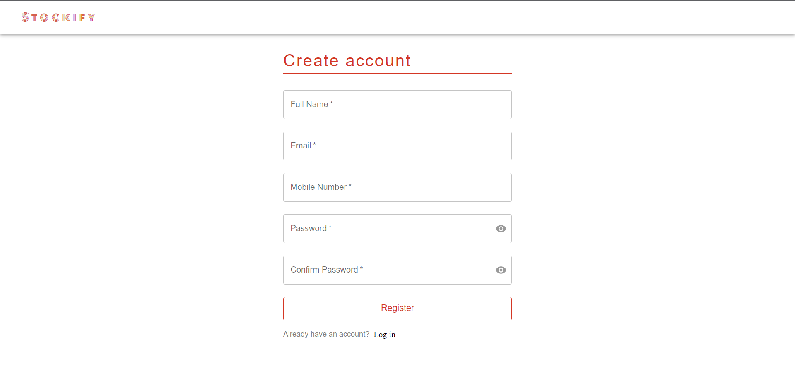
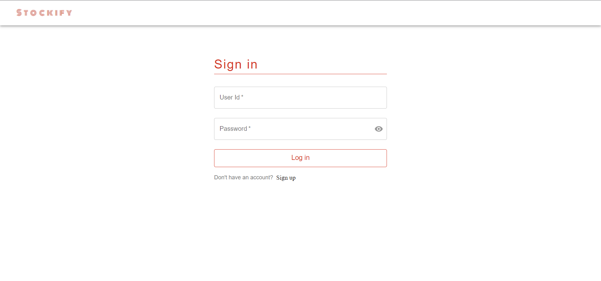
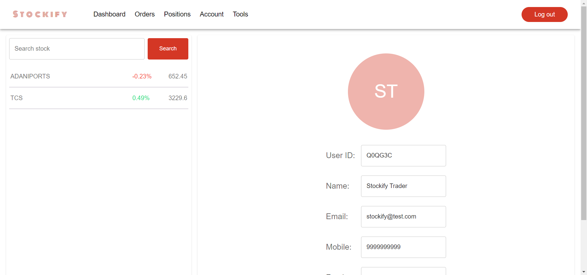
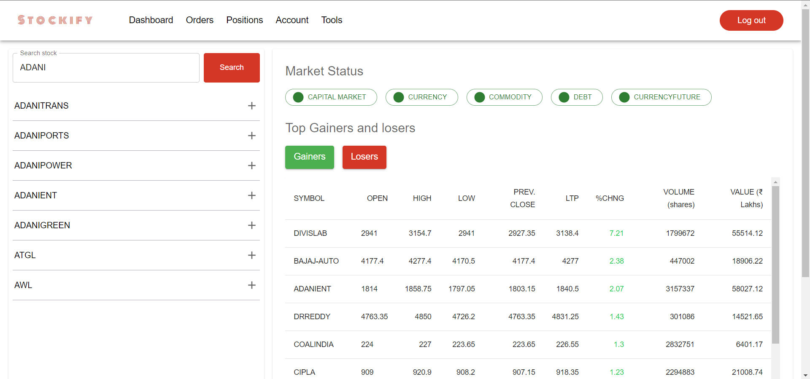
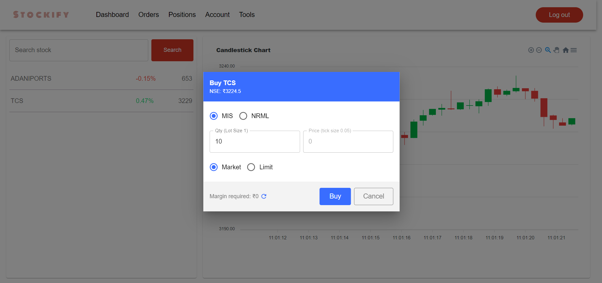
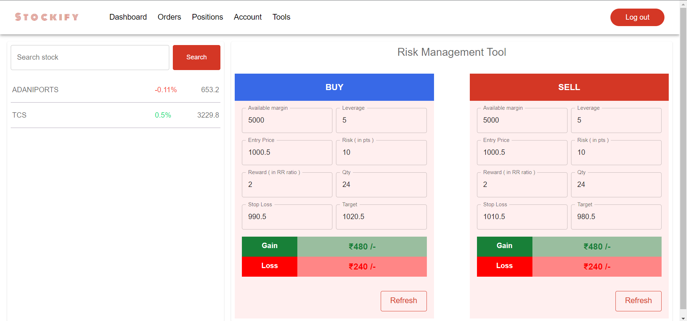

# Stockify

Stockify is a virtual trading platform designed to provide users with an interactive experience in simulated stock trading. With a range of features and risk management tools, Stockify allows users to practice trading in a realistic environment without the risk of losing real money.

## Features

- **Virtual Trading**: Users can create and manage their virtual portfolios, buy and sell stocks, and track their performance over time.

- **Real-Time Market Data**: Stockify provides real-time market data, enabling users to make informed decisions based on the latest stock prices and trends.

- **Risk Management Tools**: Stockify offers a risk management tools to help users evaluate their investment strategies, set stop-loss orders, and manage their risk exposure effectively.

- **Top gainers & loosers**: Stockify provides top  resources such as tutorials, articles, and insights to help users enhance their understanding of stock trading and investment strategies.

- **Market Status** : Stockify provides Market status of all segment at one place. 

## Installation

Follow these steps to set up Stockify locally:

1. Clone the repository: 
```
git clone https://github.com/your-username/stockify.git
```

2. Install the required dependencies:
```
cd stockify
npm install
```

3. Set up the configuration file:
- Create an .env file in the backend folder of the stockify
- Update the necessary environment variables in the `.env` file, such as database credentials and API keys.

4. Start the application:
```
For frontend: npm start
For backend: npm run dev 
```

5. Access Stockify in your web browser at `http://localhost:3000`.

## Technologies Used

- Front-end: HTML, CSS, JavaScript, React
- Back-end: Node.js, Express.js
- Database: MongoDB
- External APIs: Fyres APIs and NSE APIs

## Screenshots

<br/>
<br/>
<br/>
<br/>
<br/>
<br />



